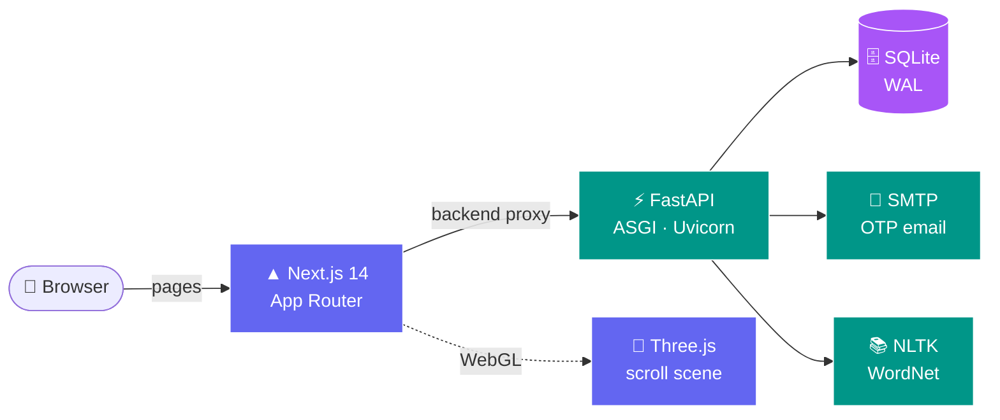
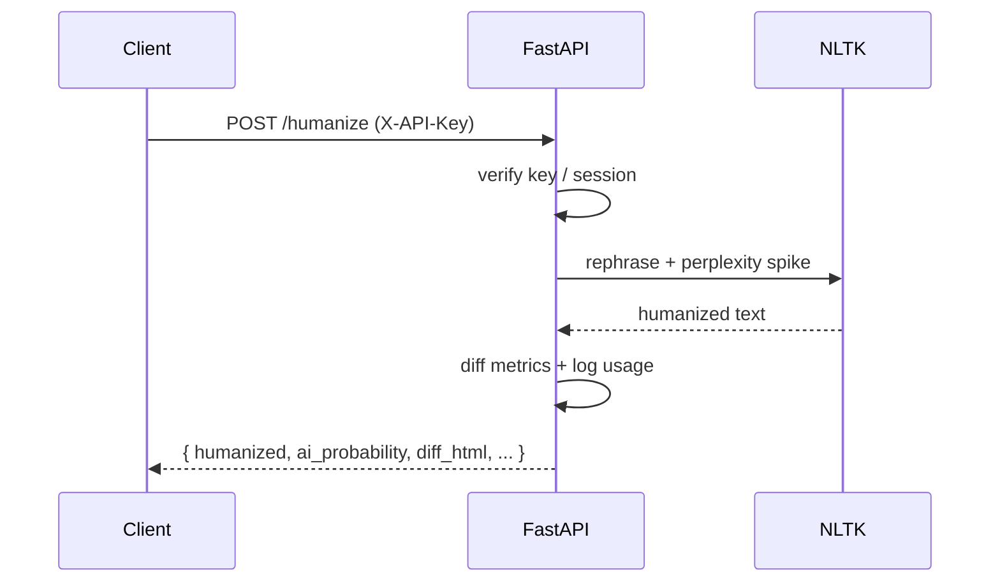

<!-- ====================== HEADER ====================== -->
<div align="center">


<a href="https://git.io/typing-svg">
  
</a>

<br/>

<!-- ====================== BADGES ====================== -->
<p>
  
  
  
  
  
</p>

<p>
  
  
  
  
</p>

<!-- ====================== PREVIEW ====================== -->
<br/>


</div>


## ✨ Overview

**AI Humanizer Pro** rewrites robotic, AI-generated text into natural writing that reads like a real person — and slips past AI detectors. It ships as a **decoupled full-stack app**:

- ⚡ **FastAPI** ASGI backend (API-only) — auth, API keys, usage analytics, OTP reset, admin console API, and the NLTK-powered humanizer.
- 🎨 **Next.js 14 + Three.js** frontend — an SEO-optimized, scroll-driven 3D landing page plus the humanizer tool, dashboard, docs, and a full admin console.

<div align="center">

</div>


## 🚀 Features

| | Feature | Description |
|:--:|:--|:--|
| 🪄 | **Deep humanization** | Restructures phrasing, perplexity & rhythm so output reads human, not machine |
| 🛡️ | **Detector-resistant** | Lowers AI-probability scores while preserving your meaning |
| 🎚️ | **Tone control** | Standard · Professional · Casual · Academic voices |
| ⚡ | **Instant results** | Async, non-blocking backend with a live before/after diff |
| 🔑 | **Developer API** | Generate keys and humanize via a single REST endpoint |
| 📊 | **Usage analytics** | Per-user request, latency & success-rate dashboard |
| 🧑‍💼 | **Admin console** | Users, API keys & a full activity log |
| 🌌 | **3D landing page** | Scroll-driven Three.js scene + Framer Motion reveals |
| 🔍 | **SEO-first** | Metadata, OpenGraph, JSON-LD, sitemap & robots |


## 🏗️ Architecture



> The Next.js dev server proxies every `/backend/*` request to FastAPI, keeping the session cookie **same-origin** (no CORS, no `SameSite` gymnastics).


## 📂 Project structure

```text
ai-humanizer-pro/
├── app.py                 # FastAPI API (auth, keys, usage, admin, humanizer)
├── gunicorn.conf.py       # Uvicorn worker config for production
├── requirements.txt       # Python deps
├── humanizer.db           # SQLite (gitignored)
└── frontend/              # Next.js 14 + Three.js
    ├── next.config.js     # /backend/* → FastAPI proxy
    ├── tailwind.config.js
    └── src/
        ├── app/           # routes: /, /humanizer, /dashboard, /docs, /admin …
        ├── components/    # three/, landing/, admin/, auth/, ui/, layout/
        ├── context/       # AuthContext
        └── lib/           # api client, site config
```


## ⚙️ Quick start

> **Prerequisites:** Python 3.11+ and Node.js 18+ (tested on 22).

### 1️⃣ Backend (FastAPI)

```bash
python -m venv .venv
# Windows: .venv\Scripts\activate   |   macOS/Linux: source .venv/bin/activate
pip install -r requirements.txt
python app.py                       # → http://127.0.0.1:5001
```

### 2️⃣ Frontend (Next.js)

```bash
cd frontend
npm install
npm run dev                         # → http://localhost:3000
```

Open **http://localhost:3000** 🎉


## 🔐 Environment variables

**Backend**

| Variable | Default | Purpose |
|:--|:--|:--|
| `SECRET_KEY` | random per start | Signs the session cookie — **set in prod** |
| `ADMIN_EMAIL` | `admin@aih.local` | Admin console login |
| `ADMIN_PASSWORD` | `ChangeAdminPassword123!` | **Change in prod** |
| `SENDER_EMAIL` | — | SMTP sender for OTP email |
| `SENDER_PASSWORD` | — | SMTP app password |
| `SMTP_SERVER` / `SMTP_PORT` | `smtp.gmail.com` / `587` | Mail server |
| `PORT` / `WEB_CONCURRENCY` | `10000` / `1` | Set by host (Render) |

**Frontend**

| Variable | Default | Purpose |
|:--|:--|:--|
| `BACKEND_URL` | `http://127.0.0.1:5001` | Proxy target for `/backend/*` |
| `NEXT_PUBLIC_SITE_URL` | `http://localhost:3000` | Canonical URL for SEO |


## 🧩 API reference

**`POST /humanize`** — authenticate with a session cookie or an `X-API-Key` header.

<details>
<summary>📦 Request</summary>

```json
{
  "text": "Your AI generated text here",
  "tone": "professional",
  "deep_mode": true
}
```
</details>

<details open>
<summary>🧪 Examples</summary>

```bash
curl -X POST https://your-domain.com/humanize \
  -H "Content-Type: application/json" \
  -H "X-API-Key: hmnz_your_api_key_here" \
  -d '{"text":"...","tone":"professional","deep_mode":true}'
```

```js
const res = await fetch("https://your-domain.com/humanize", {
  method: "POST",
  headers: { "Content-Type": "application/json", "X-API-Key": "hmnz_..." },
  body: JSON.stringify({ text: "...", tone: "professional", deep_mode: true }),
});
const data = await res.json();
console.log(data.humanized);
```
</details>




## 🗺️ Pages

| Route | Description | SEO |
|:--|:--|:--:|
| `/` | 3D scroll landing page | ✅ |
| `/humanizer` | The humanizer tool | 🔒 |
| `/dashboard` | Usage + API keys | 🔒 |
| `/docs` | API documentation | ✅ |
| `/login` · `/signup` · `/forgot-password` | Auth + OTP reset | 🔒 |
| `/admin` · `/admin/login` | Admin console | 🔒 |


## ☁️ Deployment

- **Backend → Render**: `gunicorn app:app` (uses `gunicorn.conf.py` → Uvicorn worker). Set the env vars above.
- **Frontend → Vercel**: set `BACKEND_URL` to your live API and `NEXT_PUBLIC_SITE_URL` to your domain.

> 🔴 **Note:** SQLite on ephemeral hosts resets on redeploy — use a managed Postgres or persistent disk for durable data.


## 🧭 Roadmap

- [x] FastAPI API-only backend
- [x] Next.js + Three.js frontend
- [x] Admin console in Next.js
- [x] SEO (metadata, JSON-LD, sitemap)
- [ ] Migrate SQLite → Postgres
- [ ] Rate limiting & quotas
- [ ] Stripe billing tiers


## 👤 Author

**Prithwiraj** — Toshi Consulting
📧 `digital.toshiconsulting@gmail.com`
🌐 [noai.devprithwiraj.in](https://noai.devprithwiraj.in)

<div align="center">

⭐ **If this project helped you, give it a star!** ⭐


</div>
